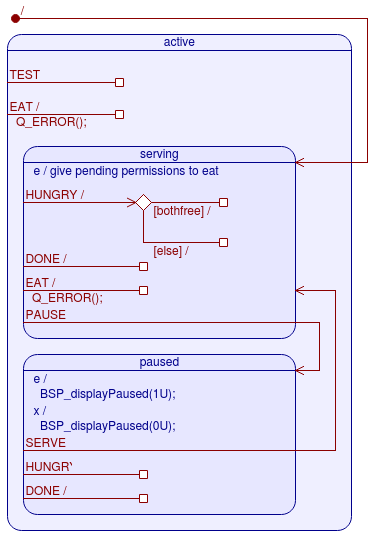
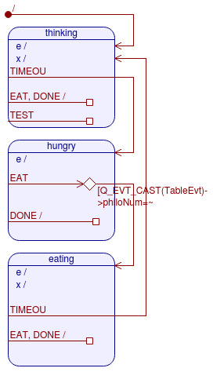

# qptoml
Automatic code generator for quantum leaps event driven framework based on toml config file

## Why do I need this tool?

[QP](https://www.state-machine.com/) (*Quantum Leaps*) is an event-driven framework for embedded systems.

It is a great framework. I have been using it time-to-time for several years.

*QM (Quantum Modeler)* which is used for automatic code generation and representing the states visually is a great tool, too.

However...

Using *QM tool* has 2 major drawbacks:

1. You can't use other text editors to edit your code. This is like one-way ticket. Therefore, you will be deprived of the benefits such as code completion, colorization etc. that popular editors (vscode, sublime text etc.) will provide.

2. It is not good at complying with git. QM (XML format) is very difficult to commit and merge properly because lots of lines change even if a tiny modification is intended.

[This](https://sourceforge.net/p/qpc/discussion/668726/thread/89676c7f/#0193/bad7/8808/e256) one and [that](https://sourceforge.net/p/qpc/discussion/668726/thread/89676c7f/#25d1) one are two of complaints in qp forum.

The proposed **qptoml** tool will use the simplicity of [toml](https://github.com/toml-lang/toml) to represent state machines textually.

It is intended to be used to generate minimal code automatically in C just to construct general state machine structure.
There is no need to be dependent upon qm tool and you don't need to write into qm editor directly. You just configure the general state structure using **qptoml** and you will handle the rest using any super cool text editor you choose.

## Dining Philosopher Problem (Dpp) Example

I will explain the **qptoml** by taking classical dpp as an example which is used in qp in examples.

Below is the visual diagram of dpp state machines taken from qm tool:




First one Table and the second one is Philo active objects.

Here is textual representations of these objects in qptoml:

```
[[object]]
  name = "Table"
  initial = "serving"

  [object.states]
    active.events = [
      {sig = "TEST", target = "active"},
      {sig = "EAT", target = "active"}
    ]

    active.serving.events = [
      {sig = "HUNGARY", target = ["active", "active"], conditions = "bothfree"},
      {sig = "DONE", target = "active"},
      {sig = "EAT", target = "active"},
      {sig = "PAUSE", target = "paused"}
    ]

    active.paused.events = [
      {sig = "SERVE", target = "serving"},
      {sig = "HUNGARY", target = "paused"},
      {sig = "DONE", target = "paused"}
    ]

[[object]]
  name = "Philo"
  initial = "thinking"

  [object.states]
    thinking.initial = ""
    thinking.events = [
      {sig = "TIMEOUT", target = "hungary"},
      {sig = ["EAT", "DONE"], target = "thinking"},
    ]

    hungary.events = [
      {
        sig = "EAT",
        target = ["eating", "hungary"],
        condition = ["Q_EVT_CAST(TableEvt)->philoNum == PHILO_ID(me)"]
      },
      {sig = "DONE", target = "hungary"}
    ]

    eating.events = [
      {sig = "TIMEOUT", target = "thinking"},
      {sig = ["EAT", "DONE"], target = "eating"}
    ]
```

Before starting to define each active object, you will need to type `[[objects]]` at the beginning.

```
name = "Table"
initial = "serving"
```

`name` is the name of the active object.
`initial` is the initial state of the active object.

```
[object.states]
     .
     .
active.serving.initial = ""
    active.serving.events = [
      {sig = "HUNGARY", target = ["active", "active"], conditions = "bothfree"},
      {sig = "DONE", target = "active"},
      {sig = "EAT", target = "active"},
      {sig = "PAUSE", target = "paused"}
    ]
```

Before starting to define state structure in an object you will need to type `[object.states]`.

`active.serving.initial = ""` assigns initial state to the *serving* state in *active* state. As it is '""', it has no initial state. This is optional if there is no initial state.

`active.serving.events = [...]` assigns an array of events that *serving* state in *active* state is waiting for. Right side of the expression **must** be an array type.

`{sig = "HUNGARY", target = ["active", "active"], conditions = "bothfree"}`:
Event signal name is *HUNGARY*. `target` is used to define states to be transitioned as a result of triggering *HUNGARY* event. `conditions` is used as guards to define which state to be transitioned. In this example, no transition occurs because the name of the target states (*active*) is the same as the name of the state.

If `target` has only one element, there is no need to assign an array. You are free to use an array, though.

If `conditions` has multiple elements, you **must** use array notation.

If `target` has only one element, you will not need to define `conditions`.

Number of elements in `condition` **must** be one element less than `target`.

It seems straightforward, isn't it?

I appreciate your thought and feedback!
